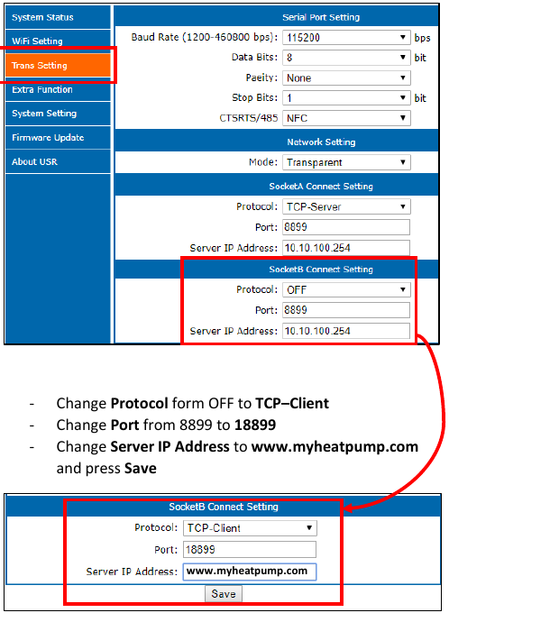
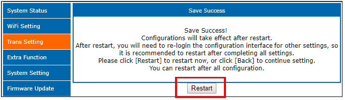
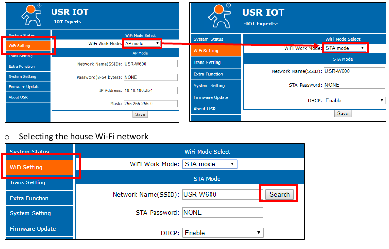
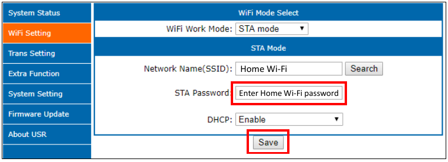
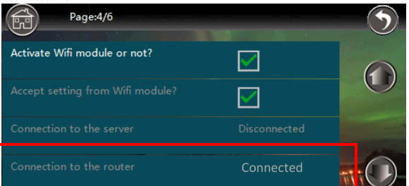

# USR-W600: подключение ES к Home Assistant вместо облака

[English](USR-W600-setup.md) · [README](../README.md)

Инструкция адаптирована по руководству ES **«Wi-Fi connection»**, файл **«2020118 RM Wi-Fi instlation manual, ver2.pdf»**, страницы 3–9. Названия полей сверены со скриншотами. Оригинал описывает подключение к облаку; направление потока на Home Assistant — адаптация для этой интеграции, проверенная на исходной установке с USR-W600. Другие модели и прошивки не проверены.

## Что меняется

Модуль сам устанавливает исходящее TCP-соединение с Home Assistant и передаёт данные насоса. Home Assistant слушает порт `18899`.

| Поле в Trans Setting | Для облака по руководству | Для ES Heatpump Local |
| --- | --- | --- |
| Network Setting → Mode | `Transparent` на скриншоте | Сохранить `Transparent` |
| Socket B → Protocol | `TCP-Client` | `TCP-Client` |
| Socket B → Port | `18899` | `18899` или порт, выбранный в интеграции |
| Socket B → Server IP Address | `www.myheatpump.com` | Локальный IPv4-адрес машины с HA |

**Пример:** если HA открывается по `http://192.168.1.50:8123`, в поле сервера вводится только `192.168.1.50`. Не добавляйте `http://`, путь или `:8123`. Адрес `0.0.0.0` относится к прослушиванию на стороне HA; в модуль его вводить нельзя.

## 1. Подготовьте Home Assistant

1. Установите интеграцию [по README](../README.md#installation), перезапустите HA и добавьте **ES Heatpump Local**.
2. Укажите **Bind address** `0.0.0.0` и **TCP port** `18899`.
3. Узнайте LAN IPv4-адрес машины с HA. Желательно закрепить его в DHCP-настройках роутера, чтобы адрес не менялся.
4. Обеспечьте доступ от Wi-Fi-модуля к этому TCP-порту. Для Docker нужен доступный порт контейнера, например публикация `18899:18899/tcp`, либо соответствующий сетевой режим. Между VLAN разрешите этот маршрут в межсетевом экране.

Перенаправление портов из интернета не требуется. Приёмник предназначен для доверенной локальной сети и не имеет аутентификации/TLS.

## 2. Если модуль уже подключён к домашней сети

1. Найдите его текущий IP в списке клиентов роутера. При необходимости сопоставьте MAC с контроллером насоса: **Other options**, страница 4, поле **MAC** (руководство, стр. 9).
2. Откройте веб-интерфейс модуля по его локальному IP. Войдите с действующими данными. В руководстве заводские логин и пароль — `admin` / `admin`; они подходят только если не были изменены.
3. Сохраните у себя снимки текущих **WiFi Setting**, **Trans Setting**, адреса сервера и портов, чтобы иметь возможность вернуться к исходной конфигурации.
4. При необходимости выберите **English** в верхней части страницы.
5. Откройте **Trans Setting**, найдите **SocketB Connect Setting**. Не перепутайте его с **SocketA Connect Setting** выше.
6. Установите **Protocol = TCP-Client**, **Port = 18899**, **Server IP Address = локальный IP HA**.
7. Нажмите **Save**, затем **Restart** на странице подтверждения. Это перезапуск Wi-Fi-модуля для применения настроек, а не заводской сброс.

Для уже работающего облачного подключения обычно меняется только адрес сервера. Сохраните действующие Wi-Fi, Socket A и Serial Port Setting. Не копируйте скорость последовательного порта со скриншота: она должна соответствовать вашему контроллеру.

**Экран из руководства, стр. 8. На нём показан облачный сервер `www.myheatpump.com`; для локального подключения в этом поле укажите IP Home Assistant.**

После сохранения нажмите **Restart** (стр. 8):

**Не нажимайте физическую кнопку Reset для обычной смены сервера.** На стр. 3–4 руководство прямо указывает, что сброс удаляет предыдущую конфигурацию. Перезапуск всего теплового насоса для этой перенастройки не нужен.

## 3. Если модуль ещё не подключён к домашнему Wi-Fi

Этот раздел соответствует первичной настройке на стр. 5–8. Для работающего модуля пропустите его.

1. Подключите телефон или компьютер к сети модуля **USR-W600**, если она доступна. Руководство рекомендует отключить мобильные данные телефона на время настройки.
2. Откройте `http://10.10.100.254` и войдите с заводскими `admin` / `admin`, если данные не менялись. Это адрес точки доступа модуля, а не HA.
3. Выберите **English → WiFi Setting**.
4. Переключите **WiFi Work Mode** с **AP mode** на **STA mode**.
5. Нажмите **Search**, выберите домашнюю сеть **2,4 ГГц**, затем **OK**. По руководству 5 ГГц не поддерживается.
6. Введите пароль в **STA Password**, сохраните. На скриншоте руководства **DHCP = Enable**.
7. До окончательного перезапуска настройте **Trans Setting → SocketB Connect Setting** по таблице выше: `TCP-Client`, `18899`, IP Home Assistant. Проверьте **Network Setting → Mode = Transparent**. Параметры Serial Port Setting должны соответствовать контроллеру; это руководство не устанавливает универсальную скорость для всех моделей.
8. Нажмите **Save → Restart**. После перехода в STA точка доступа модуля может исчезнуть — подключитесь обратно к домашней сети и найдите новый IP модуля в роутере.

Если сеть USR-W600 отсутствует, сначала ищите модуль в роутере. Руководство описывает удержание Reset 10 секунд для заводского сброса, но это отдельная процедура восстановления с потерей настроек; она не нужна для обычной перенастройки рабочего устройства.

**WiFi Setting → STA mode → Search**, стр. 6:

**STA Password → Save**, стр. 7. Введите пароль своей сети:

## 4. Как убедиться, что всё работает

- В HA откройте устройство **ES Heatpump Local**: **Connected clients** должно показывать подключение, счётчики **Frames received**, **Short frames received**, **Long frames received** — увеличиваться, время **Last frame at** — обновляться.
- После прихода соответствующих пакетов появятся температуры и другие значения. Сравните температуру воды с экраном насоса.
- В публичной alpha команды ГВС отключены. Поля `fresh_verified` и `verified_packet_age_seconds` относятся к экспериментальному каналу команд; `false`/`null` здесь не означают, что приём показаний сломан.
- На контроллере **Other options → страница 4 → Connection to the router = Connected** означает подключение к роутеру. **Connection to the server** — отдельный показатель, его нельзя использовать как подтверждение работы HA. Решающее подтверждение — новые пакеты в интеграции.
- Старые значения в текущей alpha сохраняются после обрыва связи. Проверяйте время последнего пакета, а не только наличие температуры.

На экране контроллера (стр. 9) **Connection to the router** и **Connection to the server** — разные строки. Скриншот показывает подключение к роутеру, а не подтверждение приёма данных в HA:

## 5. Если данных нет

| Симптом | Что проверить |
| --- | --- |
| Модуль не видит домашний Wi-Fi | Сеть 2,4 ГГц, уровень сигнала, SSID и пароль |
| Не открывается `10.10.100.254` | Этот адрес используется при подключении к точке доступа модуля; в домашней сети нужен IP, выданный роутером |
| В HA нет подключения | Интеграция загружена; в Socket B указан IP HA и правильный TCP-порт; настройки сохранены и модуль перезапущен; нет блокировки VLAN/firewall/контейнера |
| Есть подключение, но счётчики не растут | Проверить подключение модуля к контроллеру и исходные serial-настройки; возможна несовместимость протокола |
| В логах HA ошибка привязки порта | Порт занят другим процессом/экземпляром; устранить конфликт или выбрать другой порт с обеих сторон |
| Температуры видны, но давно не менялись | Проверить Last frame at и счётчики; старые показания не подтверждают связь |

## 6. Возврат к облаку

1. Откройте веб-интерфейс модуля по его текущему LAN IP.
2. В **Trans Setting → SocketB Connect Setting** восстановите сохранённые исходные настройки. Для схемы из руководства это **Protocol = TCP-Client**, **Port = 18899**, **Server IP Address = www.myheatpump.com**. Если ваш исходный сервер отличался, верните именно его.
3. Нажмите **Save → Restart** и проверьте обновление данных на портале.

Перенаправление Socket B в HA прекращает отправку данных в облако через этот сокет. Удалённый доступ установщика, облачная история и облачные уведомления об ошибках могут перестать обновляться. Интеграция не пересылает поток в облако и не заменяет эти уведомления. При возврате Socket B к облаку локальная интеграция перестанет получать этот поток.

Создавать облачный аккаунт, привязывать MAC или вводить учётные данные myheatpump.com для локального режима не требуется. Страницы 9–14 оригинального руководства описывают облачный портал и не являются шагами настройки ES Heatpump Local.

Изображения — фрагменты руководства ES, страницы 6–9; содержимое экранов не изменено. Права на исходные иллюстрации принадлежат соответствующим правообладателям; лицензия MIT на код проекта на них не распространяется. [Источник изображений](images/README.md).
